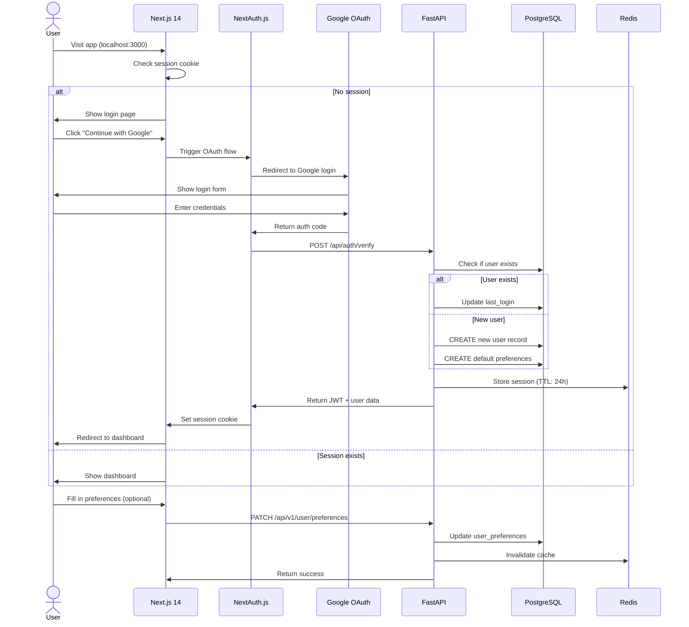
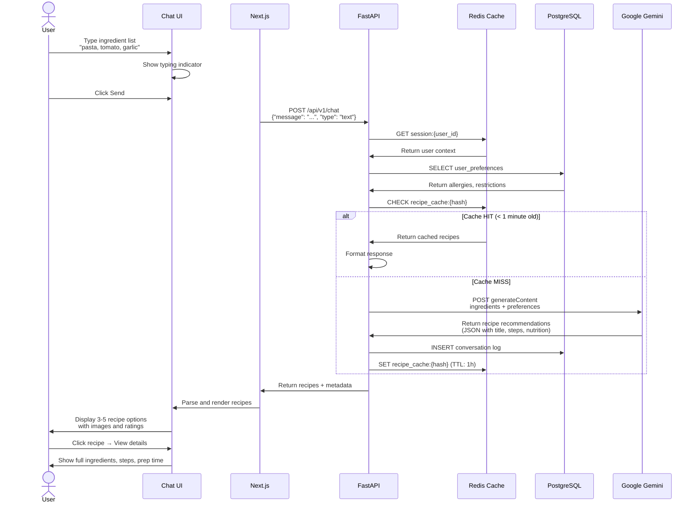
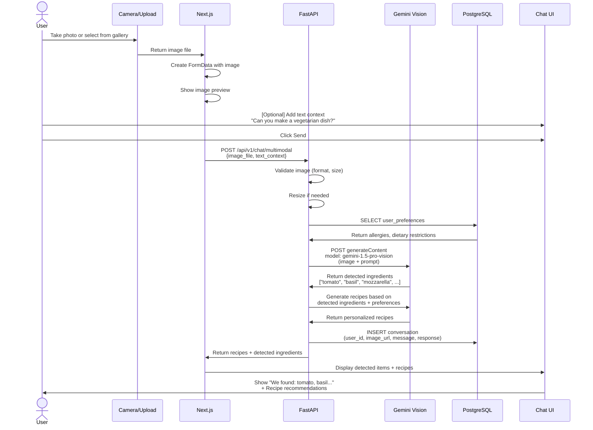
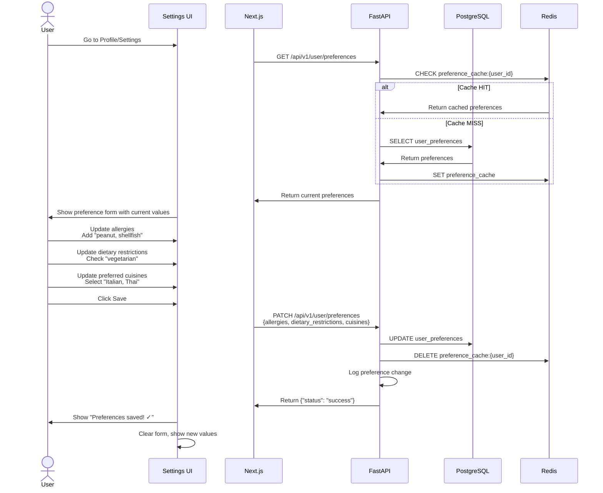
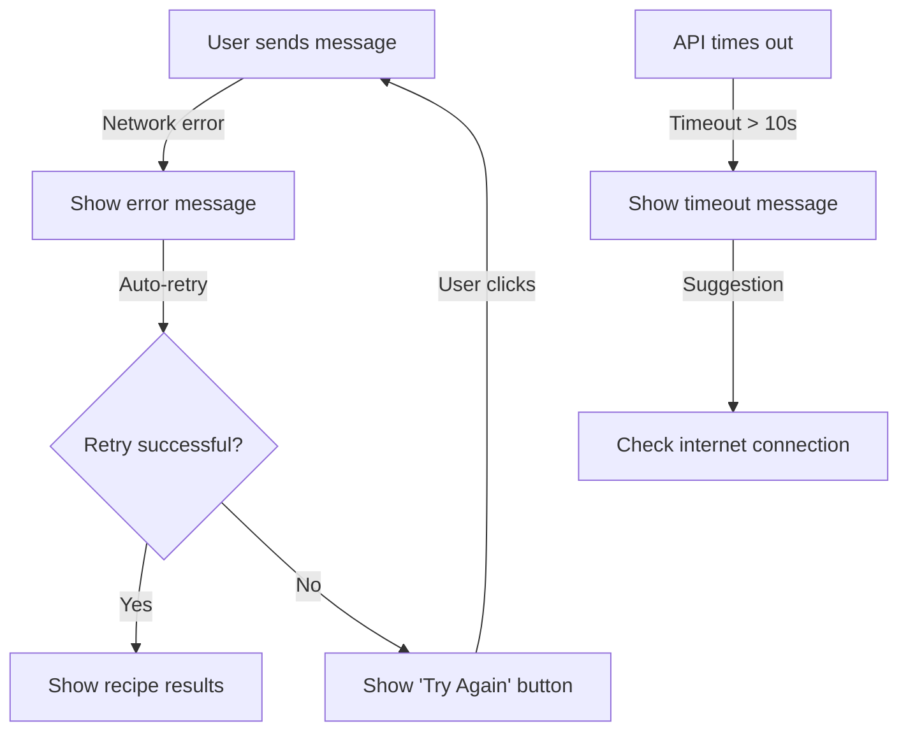
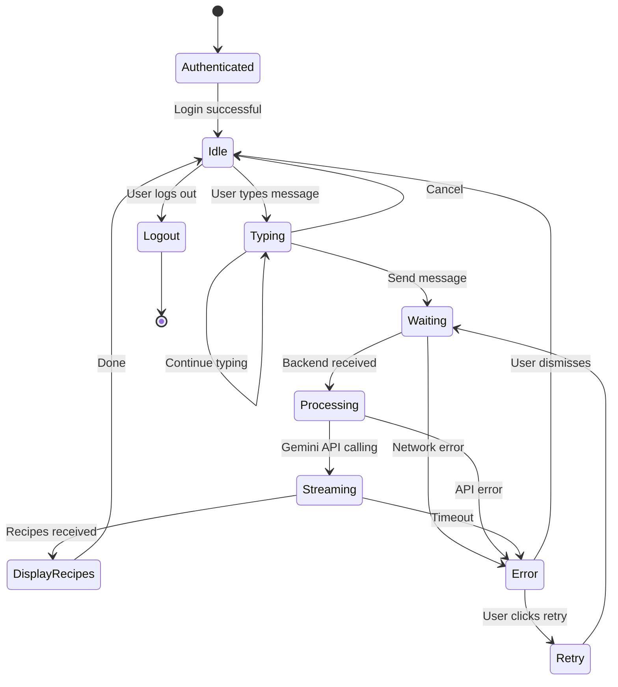

# 🔄 User Workflows & Interaction Flows

> **Last Updated**: March 29, 2026  
> **Version**: 2.0 - PostgreSQL Implementation  
> **Audience**: Product & Engineering Teams

---

## 🎯 Workflow Overview

The system supports three main user workflows:

1. **Authentication Flow** - User login and session management
2. **Recipe Discovery Flow** - Text or image-based recipe search
3. **Personalization Flow** - User preference management and customization

---

## 📋 Workflow 1: Authentication & Onboarding

### User Story

> As a new user, I want to quickly authenticate with my Google account and access the app without complicated setup

### Step-by-Step Workflow



### Success Criteria

- ✅ User logged in within 3 seconds
- ✅ Session persists across browser refreshes
- ✅ User preferences saved to database
- ✅ No manual password entry

### Error Handling

| Error          | Cause                       | Resolution                 |
| -------------- | --------------------------- | -------------------------- |
| OAuth mismatch | Redirect URI not registered | Check Google Cloud Console |
| Session lost   | Redis expired               | User re-authenticates      |
| Database error | Connection failed           | Show retry message         |

---

## 📸 Workflow 2: Recipe Discovery (Text-based)

### User Story

> As a home cook, I want to quickly find recipes based on available ingredients and preferences with AI assistance

### Detailed Flow



### UI Mockup Flow

```
┌─────────────────────────────────────┐
│  Culinary Crafts Chat               │
├─────────────────────────────────────┤
│                                     │
│ You: pasta, tomato, garlic          │
│                            [✓]      │
│                                     │
│ AI: Based on your ingredients I     │
│ found these recipes:                │
│                                     │
│ ┌────────────────────────────────┐ │
│ │ 🍝 Pasta al Pomodoro           │ │
│ │ Prep: 15 min | Cook: 20 min    │ │
│ │ ⭐ 4.8 (245 reviews)           │ │
│ │ [View Recipe]                  │ │
│ └────────────────────────────────┘ │
│                                     │
│ ┌────────────────────────────────┐ │
│ │ 🍝 Aglio e Olio                │ │
│ │ Prep: 10 min | Cook: 5 min     │ │
│ │ ⭐ 4.5 (189 reviews)           │ │
│ │ [View Recipe]                  │ │
│ └────────────────────────────────┘ │
│                                     │
├─────────────────────────────────────┤
│ [Input field] Type ingredients...   │
└─────────────────────────────────────┘
```

---

## 📸 Workflow 3: Recipe Discovery (Image-based)

### User Story

> As a busy home cook, I want to take a photo of my fridge ingredients and get recipe recommendations without typing

### Multimodal Flow



### Image Processing Pipeline

```
1. Upload & Validation (Frontend)
   ├─ Check file type (JPEG, PNG)
   ├─ Check file size (< 5MB)
   └─ Show preview

2. Backend Processing
   ├─ Save to disk/storage
   ├─ Generate thumbnail
   └─ Create secure URL

3. Gemini Vision Analysis
   ├─ Send image to Gemini 1.5 Pro Vision
   ├─ Extract detected ingredients
   ├─ Assess freshness/quality
   └─ Cross-reference with DB

4. Recipe Generation
   ├─ Filter by allergies
   ├─ Filter by dietary restrictions
   ├─ Rank by convenience
   └─ Return top 5 recipes

5. Response to User
   ├─ Show detected ingredients
   ├─ Show confidence scores
   └─ Display recipe cards
```

---

## ⚙️ Workflow 4: Preference Management

### User Story

> As a user with allergies, I want to save my dietary restrictions so recommendations are always safe

### Flow



### Preference Fields

```json
{
  "allergies": ["peanut", "shellfish", "soy"],
  "dietary_restrictions": ["vegetarian", "gluten-free"],
  "preferred_cuisines": ["Italian", "Thai", "Mediterranean"],
  "ingredients_available": ["rice", "pasta", "eggs"],
  "cooking_skill_level": "intermediate",
  "available_time": "30-minutes"
}
```

---

## 🚨 Workflow 5: Error Recovery

### Scenario: Failed API Call



### Error Codes & Messages

| Error            | Status | User Message                                                | Action                |
| ---------------- | ------ | ----------------------------------------------------------- | --------------------- |
| Invalid token    | 401    | "Session expired, please login again"                       | Redirect to login     |
| Rate limited     | 429    | "Too many requests, please wait 1 minute"                   | Disable submit button |
| Server error     | 500    | "Something went wrong, we're investigating"                 | Show support link     |
| No recipes found | 404    | "No recipes match your criteria. Try different ingredients" | Suggest alternatives  |

---

## 📊 Workflow Performance Targets

| Metric                  | Target    | Typical          |
| ----------------------- | --------- | ---------------- |
| Login time              | < 2s      | 1.5s             |
| Text search latency     | < 3s      | 2.2s             |
| Image upload + analysis | < 8s      | 5.5s             |
| Cache hit response      | < 500ms   | 300ms            |
| Preference save         | < 1s      | 0.8s             |
| Error recovery          | Immediate | Auto-retry in 2s |

---

## 🎨 State Diagram for Chat Interface



---

## 📱 Mobile-First Considerations

### Responsive Breakpoints

```
Mobile (< 640px)
├─ Single column layout
├─ Large touch targets (48px minimum)
└─ Optimize image sizes

Tablet (640px - 1024px)
├─ Two column layout
├─ Standard touch targets
└─ Balanced spacing

Desktop (> 1024px)
├─ Three column layout
├─ Mouse-optimized UI
└─ Rich typography
```

### Mobile Optimization

1. **Image Handling**
   - Compress before upload (< 1MB)
   - Progressive JPEG
   - WebP fallback

2. **Touch Interactions**
   - Larger buttons (48px+)
   - Haptic feedback where possible
   - Gesture support (swipe between recipes)

3. **Network Awareness**
   - Detect connection type
   - Show retry on offline
   - Cache recipes locally

---

## 🔐 Security in Workflows

### Data Validation

```
User Input → Sanitization → Type Checking → Database Storage

Text Input:
├─ Max 500 characters
├─ Remove special characters
└─ SQL injection protection

Image Input:
├─ Validate MIME type
├─ Check file size
├─ Scan for malware
└─ Apply access controls
```

### Session Management

```
Login → JWT Created → Stored in Redis → Sent to Client
         ├─ TTL: 24 hours
         ├─ Stored in HTTP-only cookie
         └─ Validated on each request

Logout → Delete from Redis & Cookie
```

---

## 📈 Workflow Metrics & Analytics

### Key Metrics by Workflow

**Authentication**

- Login success rate
- OAuth provider breakdown
- Session duration
- Account creation rate

**Recipe Discovery**

- Average search time
- Cache hit rate
- Gemini API latency
- Recipe click-through rate

**Personalization**

- Preference completion rate
- Preference update frequency
- Allergy addition rate

### Sample Analytics Query

```sql
SELECT
    DATE(timestamp) as date,
    COUNT(*) as total_searches,
    AVG(response_time_ms) as avg_latency,
    SUM(CASE WHEN cache_hit THEN 1 ELSE 0 END) as cache_hits
FROM conversations
WHERE timestamp > NOW() - INTERVAL '7 days'
GROUP BY DATE(timestamp)
ORDER BY date DESC;
```

---

**Next Steps**:

1. Review workflows with product team
2. Validate UX flows with users
3. Implement A/B testing on alternatives
4. Monitor performance metrics in production
